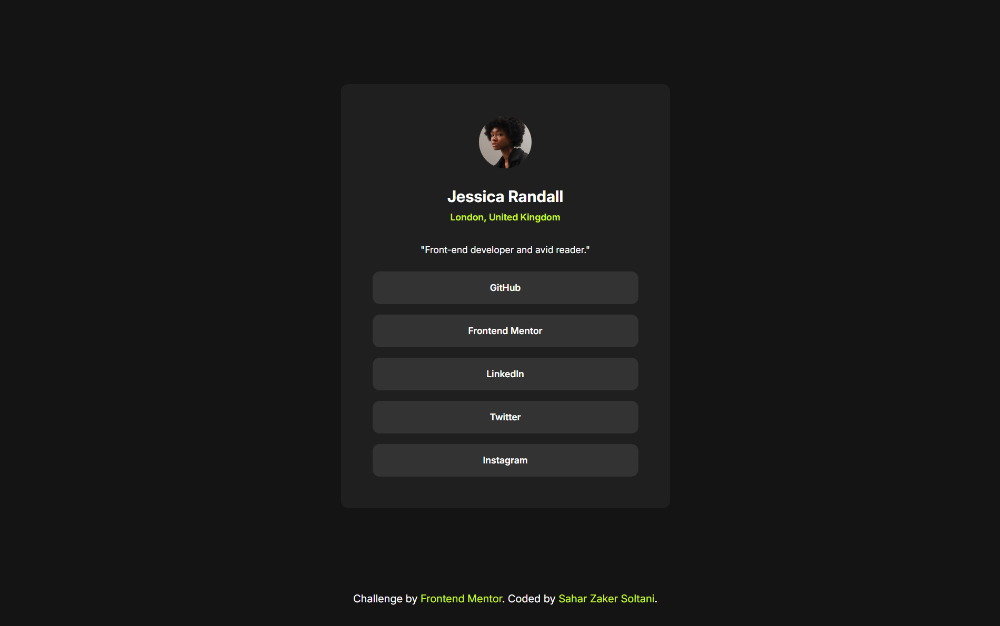

# Social Links Profile

 <!-- Replace with an actual screenshot of your project -->

This is a responsive social links profile page built as part of the [Frontend Mentor](https://www.frontendmentor.io) challenges. The goal of this project was to create a clean and responsive profile page that links to various social media platforms.

## Table of Contents

- [Overview](#overview)
  - [The Challenge](#the-challenge)
  - [Links](#links)
- [My Process](#my-process)
  - [Built With](#built-with)
  - [What I Learned](#what-i-learned)

- [Acknowledgments](#acknowledgments)
- [Contact](#contact)

## Overview

### The Challenge

The challenge was to build a responsive social links profile page that:

- Displays a profile picture, name, and location.
- Provides a list of clickable social media links.
- Adapts to different screen sizes (mobile, tablet, and desktop).
- Follows the design provided by Frontend Mentor.

### Links

- [Live Site](https://saharzakersoltani.github.io/social-links-profile-main/) 
- [Frontend Mentor Challenge](https://www.frontendmentor.io/challenges/social-links-profile-UG32l9m6dQ) 

## My Process

### Built With

- Semantic HTML5 markup
- CSS custom properties
- Flexbox
- CSS Grid
- Mobile-first workflow
- [Google Fonts](https://fonts.google.com/) for typography

### What I Learned

- **Responsive Design**: I reinforced my understanding of creating responsive layouts using CSS Grid and Flexbox.
- **CSS Custom Properties**: I utilized CSS variables to maintain consistent styling across the project.
- **Accessibility**: I ensured the page is accessible by using semantic HTML and proper ARIA attributes.

## Acknowledgments

- **Frontend Mentor**: For providing the design challenge and assets.
- **Community**: Thanks to the open-source community for providing resources and inspiration.

## Contact

If you have any questions or feedback, feel free to reach out:

- **Sahar Zaker Soltani**
- **GitHub**: [saharzakersoltani](https://github.com/saharzakersoltani)
- **Email**: [sahar.zs2002@gmail.com]

